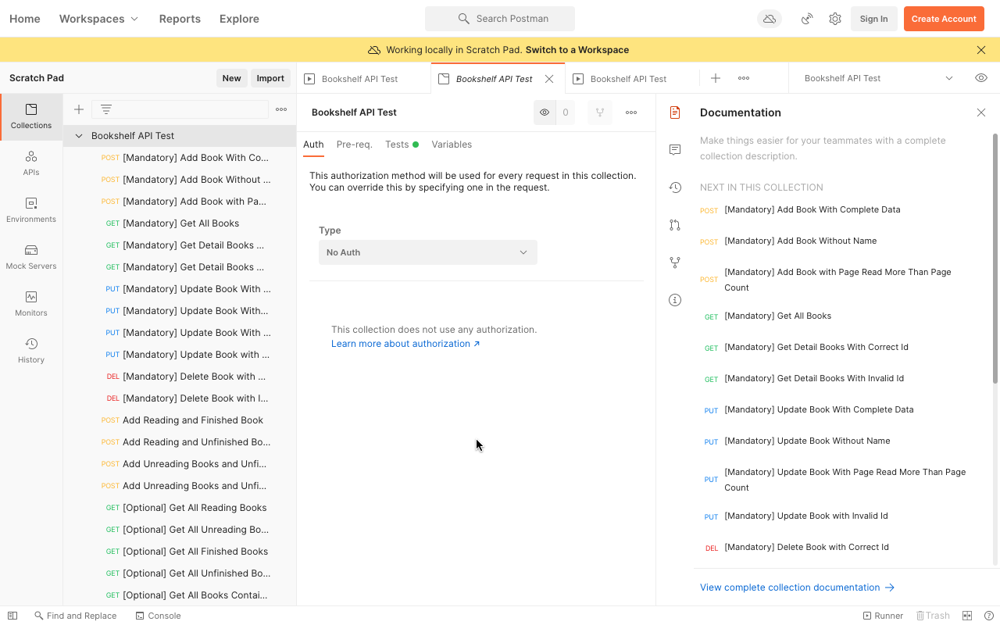

# Submission Bookshelf API

Dibuat untuk menyelesaikan kelas **Belajar Membuat Aplikasi Back-End untuk pemula - Dicoding** dengan membuat proyek **Bookshelf API** sesuai dengan kriteria dibawah ini :

## Kriteria Bookshelf API

Terdapat 5 kriteria yang diberikan oleh dicoding academy yaitu :

### Kriteria 1 : API dapat menyimpan buku

API dibuat harus dapat menyimpan buku melalui route :

-   Method : **POST**
-   URL : ```/books```
-   Body Request :
    ```
    { 
     "name": string,
     "year": number,
     "author": string, 
     "summary": string, 
     "publisher": string, 
     "pageCount": number, 
     "readPage": number, 
     "reading": boolean 
     }
     ```

    Server harus merespon gagal bila :
-   Client tidak melamprikan properti **name** pada *request body* dan akan merespons dengan :
    
    ~ Status code : 400 <br>
    ~ Response Body : 
    ```
    {
        "status": "fail",
        "message": "Gagal menambahkan buku. Mohon isi nama buku"
    }
    ```
- Apabila client melampirkan nilai properti **readPage** > **pageCount** maka server akan meresponse dengan :
  
    ~ Status Code : 400 <br>
    ~ Response Body : 
    ```
    {
        "status": "fail",
        "message": "Gagal menambahkan buku. Mohon isi nama buku"
    }
    ```

- Apabuka gagal memasukan buku karena alasan umum (*Generic Error*) maka server akan merespons dengan :
  
  ~ Status Code : 500 <br>
  ~ Response Body :
  ```
      {
        "status": "error",
        "message": "Buku gagal ditambahkan"
    }
  ```
- Apabila buku **Berhasil Dimasukan**, maka server mengembalikan response dengan : 
  
    ~ Status Code : 201 <br>
    ~ Response Body :
    ```
        {
        "status": "success",
        "message": "Buku berhasil ditambahkan",
        "data": {
            "bookId": "XXXXXX"
        }
    }
    ```

### Kriteria 2 : API dapat menampilkan seluru Buku
API yang dibuat harus dapt menampilkan seluru buku yang disimpan melalui route :

- Method    : **GET**
- URL       : ```/books```
  
Server harus mengembalikan response dengan :
- Status Code : 200
- Response Body :
  ```
      {
        "status": "success",
        "data": {
            "books": [
                {
                    "id": "XXXX",
                    "name": "Buku ",
                    "publisher": "Dicoding Indonesia"
                },
                {
                    "id": "XXXX",
                    "name": "Buku B",
                    "publisher": "Dicoding Indonesia"
                },
                {
                    "id": "XXXX",
                    "name": "Buku C",
                    "publisher": "Dicoding Indonesia"
                }
            ]
        }
    }
  ```
  Jika buku masi kosong maka server akan merespons dengan :
  ```
      {
        "status": "success",
        "data": {
            "books": []
        }
    }
  ```

### Kriteria 3 : API dapat menampilkan detail buku
API yang dibuat harus dapat menampilkan detail buku yang disimpan di dalam server dengan :
- Method : **GET**
- URL : ```/books/{bookId}```
  
Bila buku dengan id yang dilampirkan oleh client tidak ditemukan, maka server harus mengembalikan respons dengan:
- Status Code : 404
- Response Body : 
  ```
    {
        "status": "fail",
        "message": "Buku tidak ditemukan"
    }
  ```

Bila buku dengan id yang dilampirkan ditemukan, maka server harus mengembalikan respons dengan:
- Status Code : 200
- Response Body :
    ```
    {
        "status": "success",
        "data": {
            "book": {
                "id": "aWZBUW3JN_VBE-9I",
                "name": "Buku A Revisi",
                "year": 2011,
                "author": "Jane Doe",
                "summary": "Lorem Dolor sit Amet",
                "publisher": "Dicoding",
                "pageCount": 200,
                "readPage": 26,
                "finished": false,
                "reading": false,
                "insertedAt": "2021-03-05T06:14:28.930Z",
                "updatedAt": "2021-03-05T06:14:30.718Z"
            }
        }
    }
    ```
### Kriteria 4 : API dapat mengubah data buku
API harus dapat mengubah data buku berdasarkan **id** melalui route :
- Method : PUT
- URL : ```/books/{bookId}```
- Body Request :
    ```
    {
        "name": string,
        "year": number,
        "author": string,
        "summary": string,
        "publisher": string,
        "pageCount": number,
        "readPage": number,
        "reading": boolean
    }
    ```
Server harus merespons gagal bila :
- Client tidak melampirkan properti **name** pada *request body*. Bila hal ini terjadi maka *server* akan merespons dengan :
  - Status Code : 400
  - Response Body : 
    ```
    {
        "status": "fail",
        "message": "Gagal memperbarui buku. Mohon isi nama buku"
    }
    ```
- Client melampirkan nilai properti **readPage** > **pageCount**. Bila hal ini terjadi maka *server* akan meresponse dengan :
  - Status Code : 400
  - Response Body : 
    ```
    {
        "status": "fail",
        "message": "Gagal memperbarui buku. readPage tidak boleh lebih besar dari pageCount"
    }
    ```
- **Id** yang dilampirkan oleh client tidak ditemukkan oleh *server*. Bila hal ini terjadi, maka *server* akan merespons dengan:
  - Status Code : 404
  - Response Body : 
    ```
    {
        "status": "fail",
        "message": "Gagal memperbarui buku. Id tidak ditemukan"
    }
    ```
- Bila buku **berhasil diperbarui**, server harus mengembalikan respons dengan:
  - Status Code :200
  - Response Body : 
    ```
    {
        "status": "success",
        "message": "Buku berhasil diperbarui"
    }
    ```

### Kriteria 5 : API dapat menghapus buku
- Method : DELETE
- URL : ```/books/{bookId}```
  
Bila **id** yang dilampirkan tidak dimiliki oleh buku manapun, maka server harus mengembalikan respons berikut:
- Status Code : 404
- Response Body : 
    ```
    {
        "status": "fail",
        "message": "Buku gagal dihapus. Id tidak ditemukan"
    }
    ```
Bila **id** dimiliki oleh salah satu buku, maka buku tersebut harus dihapus dan server mengembalikan respons berikut:
- Status Code : 200
- Response Body : 
    ```
    {
        "status": "success",
        "message": "Buku berhasil dihapus"
    }
    ```
---

## Pengujian API

Untuk memastikan API berjalan sesuai kriteria maka dilakukan pengujian mengunakan software *postman* dengan configurasi file sebagai berikut :

[Berkas Pengujian](https://github.com/dicodingacademy/a261-backend-pemula-labs/raw/099-shared-files/BookshelfAPITestCollectionAndEnvironment.zip) 



Jika sudah siap maka jalankan pengujian terhadap API yang sudah dibuat : 

